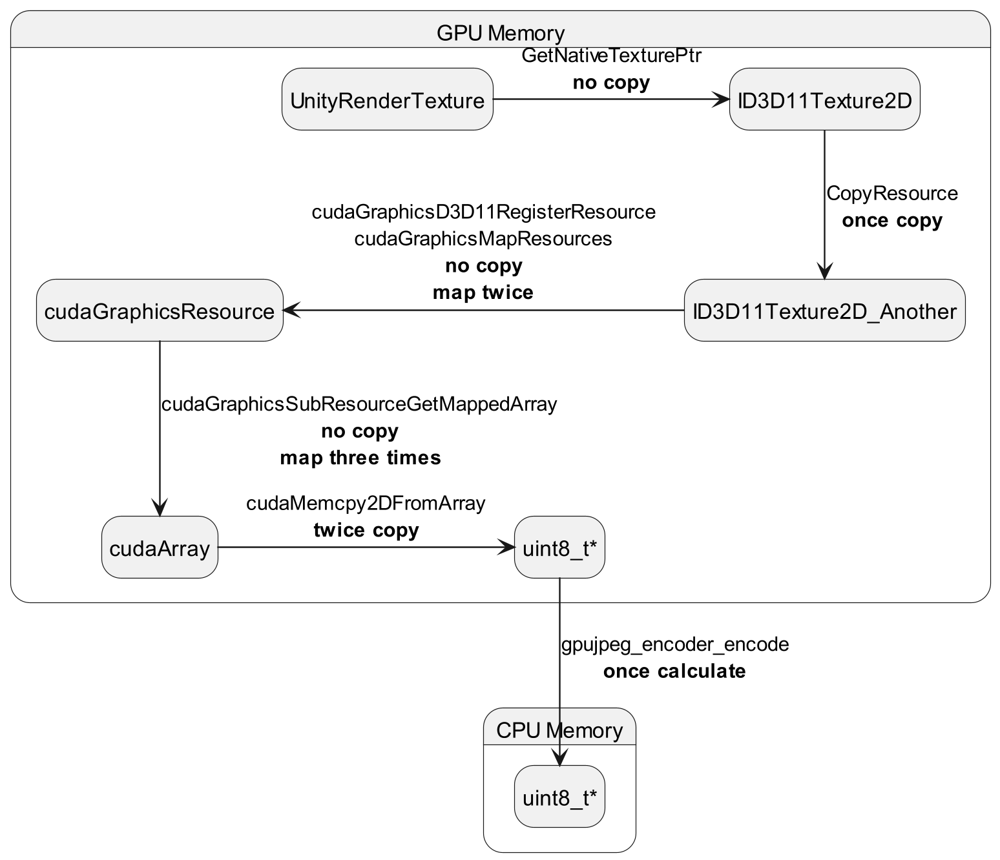

# Unity Native Rendering Plugin D3D11 CUDA
## 简述

- 此项目可用于生成一个DLL，并在Unity中调用，通过传入`RenderTexture.GetNativeTexturePtr()`，可以在GPU上以极高的性能（200FPS with 2K RTX3060）编码为JPEG。
- 此外，此库尽可能地实现了显存的懒分配与复用，以提升部分性能。
## 注意
此库的定位是**高效的图像压缩解决方案**，目的是在分布式场景中允许单个Unity节点在**带宽、CPU、GPU**为瓶颈的情况下，尽可能高效地将多个Camera的截取内容分发至其他节点，因此存在如下的特性，并且无改正计划：
- **输出图像y轴反转**：由于Unity使用的坐标轴与其他技术不同，因此输出的图像在y轴上是上下反转的。考虑到此行为可由分布式节点完成，在主流程内执行则会受限，因此未进行翻转。
- **输出图像未切割**：在此库的演示项目中，选择将多个Camera渲染至单个RenderTexture，并对单个RenderTexture进行整体jpeg编码，这种整体渲染方式只需单次调用渲染管线以提升性能。同样地，图像切割任务应该由其他节点负责。
## 来源
该项目主要基于Unity官方的[NativeRenderingPlugin](https://github.com/Unity-Technologies/NativeRenderingPlugin)进行修改，并引入了[GPUJPEG](https://github.com/CESNET/GPUJPEG)完成jpeg编码加速。
## 构建
为构建此项目，需要的项如下：
| 项                                           | 推荐版本      | 作用                       |
| -------------------------------------------- | ------------- | -------------------------- |
| VisualStudio                                 | 2022          | c++端dll项目               |
| Unity                                        | 2021.3.19f1c1 | 示例项目，必须基于dx11运行 |
| CUDA                                         | 12.4          | CUDA库                     |
| DirectX                                      | 11            | Unity底层图像库            |
| [GPUJPEG](https://github.com/CESNET/GPUJPEG) | master        | 基于cuda的jpeg编码         |

此外，该项目的环境相对局限，仅确保在Windows的x86_64平台上可使用。
准备好上述环境后，可按照如下流程开始构建项目。

### 编译[GPUJPEG](https://github.com/CESNET/GPUJPEG)
在拉取[该库](https://github.com/CESNET/GPUJPEG)的代码后，按照其文档提供的方式完成对GPUJPEG的编译。在`GPUJPEG\build\Debug`下，将`gpujpeg.dll` `gpujpeg.lib`两个文件拷贝至此项目的如下位置：
- C++组件编译时：`.\PluginSource\source\gpujpeg`

此外，为支持项目运行，需要将`gpujpeg.dll`拷贝至如下位置：
- `.\UnityProject\Assets\Plugins`


### 构建DLL
双击打开[.\\PluginSource\\projects\\VisualStudio2022\\RenderingPlugin.sln]()。
确认项目使用Release x64配置，然后执行`生成->重新生成解决方案`。
## 使用
此库提供非常简单的用法，对于如何在Unity项目中引入该库，可在Unity Hub中打开[.\UnityProject]()并观察其项目结构。

需要注意到点是对于需要编码的RenderTexture，下述参数必须强制指定：
| 参数         | 值             |
| ------------ | -------------- |
| Dimension    | 2D             |
| Color Format | R8G8B8A8_UNORM |

该库提供如下的Encode在Unity下的用法：
### EncodeJPEG
该方法为该库的核心方法，通过传入RenderTexture的指针，完成对该帧图像的编码。该方法使用了较多的懒加载方式，因此首次执行的耗时可能较高。
#### 入参
- `IntPtr textureHandle`：renderTexture的指针，通常为`renderTexture.GetNativeTexturePtr()`
- `int textureWidth`：renderTexture的宽，同样也是编码出的jpeg图的宽。通常为`renderTexture.width`
- `int textureHeight`：renderTexture的高，同样也是编码出的jpeg图的高。通常为`renderTexture.height`
- `int rowPitch`：底层图形库使用的行宽，此值在R8G8B8A8_UNORM的格式下，通常为`renderTexture.width*4`，因为每个像素的单通道为1byte，四通道即为4byte，rowPitch的单位是byte
- `out length`：该值说明了编码后的jpeg的byte长度。
#### 返回
- `IntPtr`：该指针指向一段byte数组，表述jpeg图像的数据，其长度被`out length`指定。该指针指向的内存无需由用户释放，在下次调用`EncodeJPEG`时会被自动释放，换言之，该指针直到下次EncodeJPEG调用前都有效。
#### C代码定义
```c
extern "C" UNITY_INTERFACE_EXPORT  uint8_t * UNITY_INTERFACE_API EncodeJPEG(
    void* textureHandle, 
    int textureWidth, 
    int textureHeight, 
    int rowPitch, 
    size_t * length)
```
### SetLog
该方法可用于设置DLL库的日志输出相关项，默认关闭。
#### 入参
- `bool enable`：设置是否启用日志
- `string path`：设置日志记录位置，需要传入一个以0为结尾的字符串，在C#中，考虑`path+"\0"`
#### 返回
无
#### C代码定义
```c
extern "C" UNITY_INTERFACE_EXPORT void UNITY_INTERFACE_API SetLog(bool enable,const char * path)
```

### ClearCache
该方法可用于清理目前在使用的资源，譬如在d3d11和cuda中分配的资源与内存。通常该方法是不需要调用的。
#### 入参
无
#### 返回
无
#### C代码定义
```c
extern "C" UNITY_INTERFACE_EXPORT void UNITY_INTERFACE_API ClearCache()
```

## 处理流程
该库的处理流程简而言之：
1. Unity：`RenderTexture.GetNativePtr()`
2. D3D11：`ID3D11Texture2D`
3. GPU Memory：`cudaMalloc()`
4. GPUJPEG：`gpujpeg_encoder_encode`
5. Unity：`IntPtr`

除去最后的流程，所有的行为全部在GPU上完成，从而最大程度地减少GPU-CPU间数据传输的消耗（通常上限为32GBps,PCIE 4.0）。

其具体流程较复杂，可见[.\PluginSource\projects\source\RenderAPI_D3D11.cpp]()

对于流程中的内存、显存间传递情况，如图所示：

## 性能
### 环境配置
| 配置项 | 参数            |
| ------ | --------------- |
| CPU    | Intel i7-12700  |
| 内存   | 32GB            |
| GPU    | NVIDIA RTX 3060 |
| Unity  | UnityEditor     |
### 简单测试
简单测试基于此库中提供的场景开展，具备如下特点：
1. 不记录日志
2. 编码后，采用Marshal.Copy将数据读取到Unity内存中
3. 多个Camera渲染到同一个RenderTexture

场景参数（不记录为0的参数）：
   - Batches:222
   - Tris:81.5k
   - Verts:53.5k
   - SetPass calls:162 
   - Shadow casters:60

测试结果：

| Camera数量 | 图像尺寸         | main thread(ms) | render thread(ms) | FPS     | GPU 3D Load | GPU Copy Load | GPU Cuda Load |
| ---------- | ---------------- | --------------- | ----------------- | ------- | ----------- | ------------- | ------------- |
| 1          | 1920x1080(1080p) | 2.6~2.9         | 1.4~1.5           | 360~400 | 24%         | 12%           | 18%           |
| 1          | 2560x1440(2k)    | 3.2~3.6         | 2.0~2.1           | 290~320 | 27%         | 10%           | 22%           |
| 1          | 4096x2160(4k)    | 5.1~5.5         | 3.8~3.9           | 170~195 | 31%         | 6%            | 38%           |
| 1          | 4096x4096        | 8.1~8.3         | 6.5~6.6           | 119~123 | 34%         | 4%            | 32%           |
| 1          | 5120x3600        | 8.8~9.3         | 7.0~7.2           | 103~112 | 35%         | 4%            | 32%           |
| 20         | 1920x1080(1080p) | 4.4~4.6         | 4.4~4.8           | 216~223 | 26%         | 7%            | 12%           |
| 20         | 2560x1440(2k)    | 4.7~5.0         | 3.5~3.8           | 195~205 | 23%         | 7%            | 14%           |
| 20         | 4096x2160(4k)    | 6.7~7.0         | 5.2~5.4           | 145~150 | 28%         | 5%            | 22%           |
| 20         | 4096x4096        | 9.7~10.1        | 8.0~8.2           | 97~100  | 30%         | 3%            | 27%           |
| 20         | 5120x3600        | 10.4~10.8       | 8.7~9.3           | 89~96   | 31%         | 3%            | 26%           |

与上述测试结果相比，在CPU中完成JPEG编码的消耗（注：需要在Game中手动设置固定分辨率）：

| Camera数量 | 图像尺寸         | main thread(ms) | render thread(ms) | FPS       | GPU 3D Load | GPU Copy Load | GPU Cuda Load |
| ---------- | ---------------- | --------------- | ----------------- | --------- | ----------- | ------------- | ------------- |
| 20         | 1920x1080(1080p) | 39.8~42.7       | 39.8~40.2         | 23.4~24.7 | 33%         | 15%           | 0%            |
| 20         | 2560x1440(2k)    | 65.9~67.1       | 63.8~66.1         | 14.8~15.0 | 28%         | 13%           | 0%            |
| 20         | 4096x2160(4k)    | 142.0~154.4     | 142.0~152.5       | 6.7~6.8   | 24%         | 11%           | 0%            |
| 20         | 4096x4096        | 268.1~286.2     | 265.2~285.8       | 3.2~3.7   | 20%         | 10%           | 0%            |
| 20         | 5120x3600        | 300.8~308.8     | 297.7~303.1       | 3.2~3.5   | 16%         | 8%            | 0%            |

平均而言，采用本方案与Unity原生方案相比,带来的提升最高可达2700%：
| 图像尺寸         | GPU FPS | CPU FPS | 提升(%) |
| ---------------- | ------- | ------- | ------- |
| 5120x3600        | 92.5    | 3.3     | 2703    |
| 4096x4096        | 98.5    | 3.4     | 2797    |
| 4096x2160(4k)    | 147.5   | 6.7     | 2101    |
| 2560x1440(2k)    | 200     | 14.9    | 1242    |
| 1920x1080(1080p) | 219.5   | 24.0    | 812.5   |
### 场景测试
采用Unity商城中的[纽约城市场景](https://assetstore.unity.com/packages/3d/environments/urban/real-new-york-city-vol-1-208247)，并设置20个Camera不断旋转

场景参数（不记录为0的参数）：
- Batches：~20k
- Saved by batching：~14k
- Tris：~13M
- Verts：14M
- SetPass calls：~4000
- Shadow Casters：0

测试结果：

| Camera数量 | 图像尺寸         | main thread(ms) | render thread(ms) | FPS   | GPU 3D Load | GPU Copy Load | GPU Cuda Load |
| ---------- | ---------------- | --------------- | ----------------- | ----- | ----------- | ------------- | ------------- |
| 20         | 1920x1080(1080p) | 22.4~26.1       | 22.2~25.8         | 38~42 | 40%         | 2%            | 2%            |
| 20         | 2560x1440(2k)    | 23.6~29.3       | 22.4~26.7         | 38~42 | 42%         | 1%            | 3%            |
| 20         | 4096x2160(4k)    | 25.4~31.5       | 25.1~29.3         | 36~39 | 39%         | 1%            | 6%            |
| 20         | 4096x4096        | 19.7~20.5       | 17.2~19.1         | 49~51 | 34%         | 15%           | 2%            |
| 20         | 5120x3600        | 23.5~26.0       | 22.5~24.5         | 38~41 | 35%         | 1%            | 13%           |